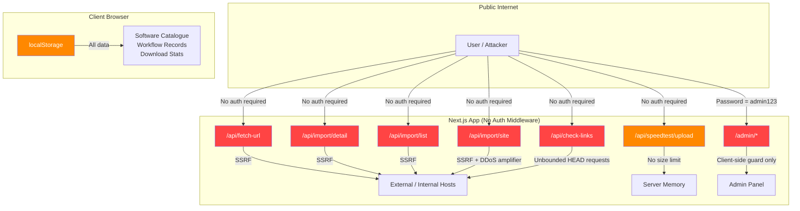

# Comprehensive Code Review: Security, Performance & Quality

**Project:** fileshare (Next.js 16 / React 19 app)
**Review Date:** 2026-08-17
**Reviewer:** Lyzo

---

## Executive Summary

The codebase is a Next.js application that serves as a software/game download catalogue with an admin panel and an import tool that scrapes third-party sites. The review uncovered **4 critical security vulnerabilities**, **6 high-severity issues**, and a range of performance and quality concerns. The most urgent issues are the hardcoded admin password exposed in client-side code and the completely unauthenticated, rate-limit-free API routes that act as open SSRF proxies.

---

## Severity Legend

| Level | Meaning |
|---|---|
| 🔴 Critical | Exploitable immediately; fix before any deployment |
| 🟠 High | Significant risk; fix in the next sprint |
| 🟡 Medium | Should be addressed; degrades security or reliability |
| 🟢 Low / Quality | Best-practice improvements |

---

## 1. Security Issues

### 🔴 CRIT-1 — Hardcoded Password Exposed in Client Bundle

**File:** [`src/components/admin/AuthProvider.tsx`](src/components/admin/AuthProvider.tsx:21)

```ts
const ADMIN_PASSWORD = "admin123";
```

**Line 75 of the login page** even prints it in the UI:

```tsx
<p className="text-blue-300/40 text-xs text-center mt-4">Default password: admin123</p>
```

**Impact:** The password is compiled into the client-side JavaScript bundle and is visible to anyone who opens DevTools or views the page source. Any visitor can log in to the admin panel.

**Fix:**
- Move authentication to a server-side API route (`/api/admin/login`) that validates against an environment variable (`ADMIN_PASSWORD` in `.env.local`).
- Issue a signed, `httpOnly` session cookie (e.g. via `iron-session` or NextAuth.js).
- Remove the "Default password" hint from the UI entirely.
- The `AuthProvider` should only store a boolean derived from a server-validated session, never the password itself.

---

### 🔴 CRIT-2 — Admin Panel Has No Server-Side Authentication

**File:** [`src/components/admin/AdminGuard.tsx`](src/components/admin/AdminGuard.tsx:14)

The entire admin guard is a **client-side React component**. It redirects unauthenticated users in the browser, but the underlying admin pages and all `/api/*` routes are fully accessible without any credentials via direct HTTP requests.

**Impact:** Any attacker who bypasses the React redirect (e.g. by calling the API directly, disabling JavaScript, or using `curl`) has full admin access.

**Fix:**
- Add a Next.js middleware (`middleware.ts`) that checks for a valid session cookie on every `/admin/*` and `/api/admin/*` request and returns `401`/`302` server-side.
- The client-side guard can remain as a UX convenience but must not be the only protection.

---

### 🔴 CRIT-3 — Open SSRF Proxy on All Fetch-URL API Routes (No Auth, No Rate Limiting)

**Files:**
- [`src/app/api/fetch-url/route.ts`](src/app/api/fetch-url/route.ts:40)
- [`src/app/api/import/detail/route.ts`](src/app/api/import/detail/route.ts:74)
- [`src/app/api/import/list/route.ts`](src/app/api/import/list/route.ts:69)
- [`src/app/api/import/site/route.ts`](src/app/api/import/site/route.ts:88)

All four routes accept a `?url=` query parameter and make server-side HTTP requests to that URL with no authentication, no rate limiting, and no allowlist/denylist of target hosts.

**Impact (SSRF):**
- An attacker can use your server to probe internal network services (e.g. `http://169.254.169.254/` AWS metadata, `http://localhost:6379` Redis, internal databases).
- The server's IP is used for all outbound requests, enabling IP-based abuse of third-party services.
- The `import/site` route crawls up to 40 sitemaps × 10 pages concurrently — trivially weaponisable as a DDoS amplifier.

**Fix:**
1. Require admin authentication on all import routes (middleware or inline check).
2. Add a denylist of private/loopback IP ranges before making any outbound request:
   ```ts
   import { isPrivateIP } from "some-lib"; // or implement manually
   const resolved = await dns.lookup(hostname);
   if (isPrivateIP(resolved.address)) return 403;
   ```
3. Enforce a strict allowlist of permitted URL schemes (`https:` only).
4. Add rate limiting (e.g. `upstash/ratelimit` or a simple in-memory token bucket) — at minimum 10 req/min per IP.

---

### 🔴 CRIT-4 — `check-links` Route: Unbounded URL Array, No Auth, No Rate Limit

**File:** [`src/app/api/check-links/route.ts`](src/app/api/check-links/route.ts:43)

```ts
const urls: string[] = body.urls;
// No length check before batching
```

**Impact:** An attacker can POST an array of thousands of URLs, causing the server to make thousands of outbound HEAD requests. Combined with the SSRF issue above, this is a significant amplification vector.

**Fix:**
- Require admin authentication.
- Cap the array: `if (urls.length > 50) return 400`.
- Apply the same private-IP denylist as CRIT-3.

---

### 🟠 HIGH-1 — All Application State Stored in `localStorage` (No Server Persistence)

**Files:** [`src/lib/data.ts`](src/lib/data.ts:1474), [`src/lib/workflowStore.ts`](src/lib/workflowStore.ts:56)

The entire software catalogue, download statistics, user requests, contact messages, reviews, and dead-link reports are stored exclusively in the browser's `localStorage`.

**Impact:**
- Data is lost when the user clears browser storage or switches browsers/devices.
- The "admin panel" edits only affect the admin's own browser — changes are never seen by other users.
- Download counts, reviews, and reports submitted by visitors are siloed per-browser and never reach the admin.
- This is a fundamental architectural flaw for a multi-user application.

**Fix:** Introduce a server-side data store. Options in order of complexity:
1. **SQLite + Prisma** (simplest, single-server): zero infrastructure cost.
2. **Supabase / PlanetScale** (managed Postgres/MySQL): good for production.
3. **Vercel KV / Upstash Redis**: good for simple key-value needs.

All `getSoftwareList()`, `saveSoftwareList()`, `workflowStore` functions should be replaced with API routes backed by the chosen store.

---

### 🟠 HIGH-2 — Speedtest Upload Route Has No Body Size Limit

**File:** [`src/app/api/speedtest/upload/route.ts`](src/app/api/speedtest/upload/route.ts:3)

```ts
export async function POST(request: NextRequest) {
  // Reads the entire body with no size cap
  const reader = request.body.getReader();
  let bytes = 0;
  for (;;) { ... }
}
```

**Impact:** An attacker can POST an arbitrarily large body (gigabytes), exhausting server memory or disk.

**Fix:**
```ts
const MAX_UPLOAD = 500 * 1024 * 1024; // 500 MB
if (bytes > MAX_UPLOAD) { reader.cancel(); return 413; }
```

---

### 🟠 HIGH-3 — Speedtest Download Route: `Access-Control-Allow-Origin: *`

**File:** [`src/app/api/speedtest/download/route.ts`](src/app/api/speedtest/download/route.ts:33)

The download endpoint streams up to 500 MB with a wildcard CORS header. Any website can trigger a cross-origin download from your server, consuming bandwidth at the attacker's direction.

**Fix:** Restrict CORS to your own origin or remove the header entirely if the speedtest is only used from the same origin.

---

### 🟠 HIGH-4 — URL Validation Does Not Block Private/Internal Addresses (SSRF)

**Files:** All four fetch-proxy routes.

`new URL(url)` only validates URL syntax. It does not prevent targeting:
- `http://localhost:*`
- `http://127.0.0.1`
- `http://169.254.169.254` (cloud metadata)
- `http://10.0.0.0/8`, `http://192.168.0.0/16`, `http://172.16.0.0/12`
- `file://`, `ftp://`, `gopher://` schemes

**Fix:** After parsing the URL, resolve the hostname to an IP and reject private ranges. Also enforce `https:` only.

---

### 🟡 MED-1 — No HTTP Security Headers

**File:** [`next.config.ts`](next.config.ts:3)

The `next.config.ts` only sets `Cache-Control` for images. There are no security headers anywhere.

**Missing headers:**
- `Content-Security-Policy`
- `X-Frame-Options: DENY`
- `X-Content-Type-Options: nosniff`
- `Referrer-Policy: strict-origin-when-cross-origin`
- `Permissions-Policy`
- `Strict-Transport-Security` (HSTS)

**Fix:** Add a `headers()` block in `next.config.ts` for `source: "/(.*)"` with all the above headers.

---

### 🟡 MED-2 — `isCloudflareChallenge` and `BROWSER_HEADERS` Duplicated Across Three Files

**Files:**
- [`src/app/api/import/detail/route.ts`](src/app/api/import/detail/route.ts:4)
- [`src/app/api/import/list/route.ts`](src/app/api/import/list/route.ts:4)
- [`src/app/api/import/site/route.ts`](src/app/api/import/site/route.ts:4)

The same `isCloudflareChallenge()` function and `BROWSER_HEADERS` constant are copy-pasted verbatim into all three files.

**Fix:** Extract to a shared `src/lib/fetchUtils.ts` module and import from there.

---

### 🟡 MED-3 — `metadata.title` in Root Layout Contains "404"

**File:** [`src/app/layout.tsx`](src/app/layout.tsx:24)

```ts
title: "404 - Gaming & Software Vault",
```

This is almost certainly a copy-paste error. Every page that inherits the root layout metadata will have "404" in its title, which is harmful for SEO and confusing for users.

**Fix:** Change to the correct site name, e.g. `"Gaming & Software Vault"`.

---

### 🟡 MED-4 — `workflowStore` ID Generation Uses `Math.random()` (Predictable)

**File:** [`src/lib/workflowStore.ts`](src/lib/workflowStore.ts:77)

```ts
function createId(prefix: string): string {
  return `${prefix}-${Date.now()}-${Math.random().toString(36).slice(2, 8)}`;
}
```

`Math.random()` is not cryptographically secure. IDs are guessable, which matters if IDs are ever used as access tokens or in URLs.

**Fix:** Use `crypto.randomUUID()` (available in Node 14.17+ and all modern browsers).

---

## 2. Performance Issues

### 🟠 HIGH-P1 — `import/site` Route: Unbounded Concurrent Crawl

**File:** [`src/app/api/import/site/route.ts`](src/app/api/import/site/route.ts:156)

The route crawls up to 40 sitemaps in batches of 10, then crawls up to 12 category pages × 10 pagination pages = 120 additional requests, all within a single HTTP request to your server. With a 12-second timeout per fetch, a single call to this endpoint can hold a server connection open for minutes and make 160+ outbound HTTP requests.

**Fix:**
- Move this to a background job (e.g. Next.js Route Handler with `waitUntil`, or a queue).
- Return a job ID immediately and poll for results.
- Reduce concurrency limits and add a hard wall-clock timeout for the entire operation.

---

### 🟡 MED-P1 — `data.ts` Is a 1,600-Line Static Array Imported Everywhere

**File:** [`src/lib/data.ts`](src/lib/data.ts:118)

The entire software catalogue (~60 items with long descriptions) is a static TypeScript array. Every page that imports anything from `data.ts` pulls the entire 1,600-line module into its bundle.

**Fix:**
- Move data to a database (see HIGH-1).
- In the interim, use dynamic imports or split the data into per-category files.
- Ensure server components fetch only the data they need rather than importing the full array.

---

### 🟡 MED-P2 — `getDownloadStats()` Iterates the Full Software List Twice Per Call

**File:** [`src/lib/data.ts`](src/lib/data.ts:1549)

The function calls `getSoftwareList()` twice (lines 1568 and 1580), each of which parses `localStorage` JSON. For a large catalogue this is wasteful.

**Fix:** Call `getSoftwareList()` once, store in a variable, and reuse.

---

### 🟡 MED-P3 — `sitemapQueue.includes()` Is O(n) Inside a Loop

**File:** [`src/app/api/import/site/route.ts`](src/app/api/import/site/route.ts:120)

```ts
const addIfNew = (u: string) => {
  if (!sitemapQueue.includes(u)) sitemapQueue.push(u); // O(n) scan
};
```

For large sitemaps with hundreds of URLs this becomes O(n²).

**Fix:** Use a `Set<string>` for deduplication:
```ts
const sitemapSet = new Set<string>();
const addIfNew = (u: string) => { if (!sitemapSet.has(u)) { sitemapSet.add(u); sitemapQueue.push(u); } };
```

---

### 🟢 LOW-P1 — Speedtest Download Reuses the Same Seed Buffer

**File:** [`src/app/api/speedtest/download/route.ts`](src/app/api/speedtest/download/route.ts:11)

The seed is generated once and the same 1 MB chunk is enqueued repeatedly. This is fine for a speedtest but the `crypto.getRandomValues` loop fills 4 KB at a time unnecessarily — a single call with the full buffer would be cleaner.

---

## 3. Code Quality Issues

### 🟠 HIGH-Q1 — `AuthProvider` Renders Children Before Hydration Check

**File:** [`src/components/admin/AuthProvider.tsx`](src/components/admin/AuthProvider.tsx:49)

```tsx
if (!mounted) {
  return <>{children}</>;  // Renders admin content before auth state is known!
}
```

Before the `useEffect` fires (i.e. during SSR and the first client render), `isLoggedIn` is `false` but `children` are rendered anyway. The `AdminGuard` then sees `isLoggedIn = false` and renders the "Redirecting..." screen, but for a brief flash the admin content may be visible.

**Fix:** Return `null` (or a loading spinner) when `!mounted`, not `children`.

---

### 🟡 MED-Q1 — `data.ts` Contains Broken Image Paths

**File:** [`src/lib/data.ts`](src/lib/data.ts:1422)

```ts
poster: "images/portraits/dota2.jpg",  // Missing leading slash
```

All other entries use `/images/...` (absolute path). This one entry uses a relative path, which will break on any route that isn't the root.

**Fix:** Change to `"/images/portraits/dota2.jpg"`.

---

### 🟡 MED-Q2 — `data.ts` References Non-Existent Image Files

Several entries reference image paths that do not exist in `public/images/`:
- `icon: "/images/games/gta5.jpg"` — the `public/images/games/` directory does not exist (only `public/images/portraits/` and `public/images/software/` exist).
- Similarly for `minecraft.jpg`, `aoe4.jpg`, `diablo4.jpg`, `arma.jpg`, `fortnite.jpg`, `apex.jpg`, `valorant.jpg`, `lol.jpg`, and others.

**Fix:** Either add the missing images or update the `icon` fields to use the existing `poster` paths.

---

### 🟡 MED-Q3 — `eslint.config.mjs` May Not Cover All Source Files

**File:** [`eslint.config.mjs`](eslint.config.mjs)

The `package.json` lint script is just `"lint": "eslint"` with no path argument. Without an explicit path, ESLint may not lint all files consistently across environments.

**Fix:** Change to `"lint": "eslint src --ext .ts,.tsx"` or use `next lint`.

---

### 🟢 LOW-Q1 — `fetchHtml.ts` Is an Empty File

**File:** [`src/lib/fetchHtml.ts`](src/lib/fetchHtml.ts)

The file exists but is completely empty. The fetch logic it presumably was meant to contain is instead duplicated across three API route files (see MED-2).

**Fix:** Either populate this file with the shared fetch utility and import it, or delete it.

---

### 🟢 LOW-Q2 — `SITE_URL` Defaults to `http://` in Production

**File:** [`src/lib/siteConfig.ts`](src/lib/siteConfig.ts:1)

```ts
export const SITE_URL = process.env.NEXT_PUBLIC_SITE_URL || "http://localhost:3000";
```

If `NEXT_PUBLIC_SITE_URL` is not set in production, the metadata base URL will be `http://localhost:3000`, producing broken canonical URLs and Open Graph tags.

**Fix:** Add a build-time check or assertion, and ensure the environment variable is set in all deployment environments.

---

### 🟢 LOW-Q3 — No Input Sanitisation on `importParser` Output

**File:** [`src/lib/importParser.ts`](src/lib/importParser.ts) (not read in full, but called by all import routes)

The parsed HTML content (titles, descriptions, URLs) from third-party sites is returned directly to the client. If this data is ever rendered with `dangerouslySetInnerHTML` or stored and later displayed, it could introduce XSS.

**Fix:** Sanitise all string fields returned from the parser (strip HTML tags, truncate to reasonable lengths) before returning them from the API.

---

## 4. Architecture Overview & Risk Map



---

## 5. Prioritised Fix Plan

### Phase 1 — Critical (Do Before Any Public Deployment)

| # | Issue | File(s) | Effort |
|---|---|---|---|
| 1 | Move auth to server-side with env-var password + httpOnly cookie | `AuthProvider`, `AdminGuard`, new `middleware.ts`, new `/api/admin/login` | M |
| 2 | Add admin auth check to all import/fetch-url/check-links routes | All 5 API routes | S |
| 3 | Add private-IP denylist to all outbound fetch calls | All 5 API routes + new `lib/fetchUtils.ts` | S |
| 4 | Cap `check-links` URL array to 50 | `check-links/route.ts` | XS |
| 5 | Add upload body size limit to speedtest | `speedtest/upload/route.ts` | XS |

### Phase 2 — High (Next Sprint)

| # | Issue | File(s) | Effort |
|---|---|---|---|
| 6 | Add HTTP security headers (CSP, HSTS, X-Frame-Options, etc.) | `next.config.ts` | S |
| 7 | Fix `AuthProvider` pre-hydration render of children | `AuthProvider.tsx` | XS |
| 8 | Extract shared fetch utilities (deduplicate 3 files) | New `lib/fetchUtils.ts` | S |
| 9 | Fix root layout `metadata.title` "404" bug | `layout.tsx` | XS |
| 10 | Restrict speedtest CORS to same origin | `speedtest/download/route.ts` | XS |

### Phase 3 — Medium (Backlog)

| # | Issue | File(s) | Effort |
|---|---|---|---|
| 11 | Replace localStorage with a real database | `data.ts`, `workflowStore.ts`, all admin pages | L |
| 12 | Move `import/site` crawl to a background job | `import/site/route.ts` | M |
| 13 | Fix broken/missing image paths in `data.ts` | `data.ts` | S |
| 14 | Replace `Math.random()` IDs with `crypto.randomUUID()` | `workflowStore.ts` | XS |
| 15 | Fix `sitemapQueue.includes()` O(n²) with a Set | `import/site/route.ts` | XS |
| 16 | Set `NEXT_PUBLIC_SITE_URL` in all environments | `.env.production` | XS |
| 17 | Delete or populate empty `fetchHtml.ts` | `fetchHtml.ts` | XS |

---

## 6. Files Requiring Changes (Summary)

| File | Issues |
|---|---|
| [`src/components/admin/AuthProvider.tsx`](src/components/admin/AuthProvider.tsx) | CRIT-1, HIGH-Q1 |
| [`src/components/admin/AdminGuard.tsx`](src/components/admin/AdminGuard.tsx) | CRIT-2 |
| [`src/app/admin/login/page.tsx`](src/app/admin/login/page.tsx) | CRIT-1 |
| [`src/app/api/fetch-url/route.ts`](src/app/api/fetch-url/route.ts) | CRIT-3, HIGH-4 |
| [`src/app/api/import/detail/route.ts`](src/app/api/import/detail/route.ts) | CRIT-3, HIGH-4, MED-2 |
| [`src/app/api/import/list/route.ts`](src/app/api/import/list/route.ts) | CRIT-3, HIGH-4, MED-2 |
| [`src/app/api/import/site/route.ts`](src/app/api/import/site/route.ts) | CRIT-3, HIGH-4, MED-2, HIGH-P1, MED-P3 |
| [`src/app/api/check-links/route.ts`](src/app/api/check-links/route.ts) | CRIT-4, HIGH-4 |
| [`src/app/api/speedtest/upload/route.ts`](src/app/api/speedtest/upload/route.ts) | HIGH-2 |
| [`src/app/api/speedtest/download/route.ts`](src/app/api/speedtest/download/route.ts) | HIGH-3 |
| [`src/lib/data.ts`](src/lib/data.ts) | HIGH-1, MED-Q1, MED-Q2, MED-P2 |
| [`src/lib/workflowStore.ts`](src/lib/workflowStore.ts) | HIGH-1, MED-Q4 |
| [`src/lib/fetchHtml.ts`](src/lib/fetchHtml.ts) | LOW-Q1 |
| [`src/lib/siteConfig.ts`](src/lib/siteConfig.ts) | LOW-Q2 |
| [`src/app/layout.tsx`](src/app/layout.tsx) | MED-Q3 |
| [`next.config.ts`](next.config.ts) | MED-1 |
| New: `src/middleware.ts` | CRIT-2 |
| New: `src/lib/fetchUtils.ts` | MED-2, CRIT-3 |
| New: `src/app/api/admin/login/route.ts` | CRIT-1 |
